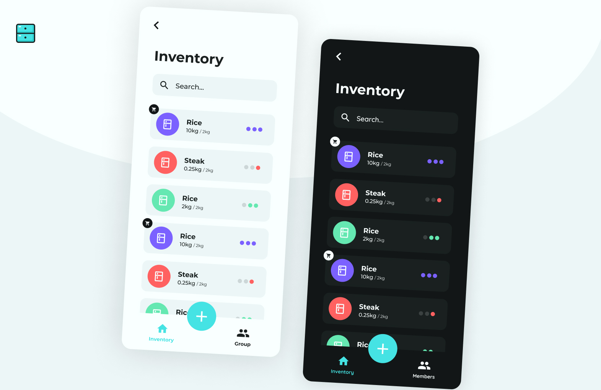

# wastend

## Introduction

**wastend is a mobile app for android and iOS, created to keep track of groceries and other consumable goods at home.**
It was created using flutter for the mobile application and NestJS for the backend.
